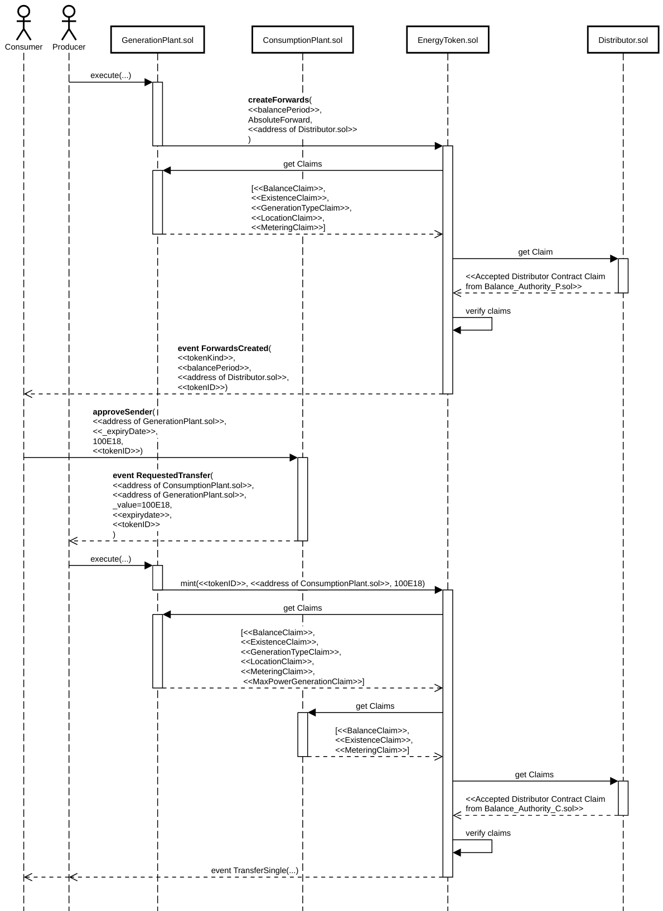

# B2E2: Technische Ausgestaltung

Die folgenden Kapitel richten sich in erster Linie an Entwickler mit Erfahrung im Bereich des
Ethereum Protokolls. Vorausgesetzt wird insbesondere das Verständnis der Funktionsweise
des [ERC 1155](https://github.com/ethereum/EIPs/issues/1155) Multi Token Standards, des [ERC 725](https://github.com/ethereum/EIPs/issues/725) Proxy Account Standards und des [ERC 735](https://github.com/ethereum/EIPs/issues/735) Claim Holder Standards.
Die Entscheidung für die ERC 725 und 735 Standards sowie die Ausgestaltung der Repräsentation von Identitäten insgesamt sind unter Anderem von den Kernzielen der [W3C Decentralized
Identifiers (DIDs)](https://www.w3.org/TR/did-core/#design-goals) (insbesondere: Dezentralierung und Selbstbestimmung) sowie den Kernkonzepten des [W3C Verifiable Credentials Data Model](https://www.w3.org/TR/vc-data-model/#claims) (insbesondere: Claims) beeinflusst, weshalb eine Auseinandersetzung mit diesen Konzepten ebenso ratsam ist.

## Ethereum’s Proof of Authority Protokoll

Wir verwenden das Ethereum Protokoll wegen der Popularität und der Möglichkeit Smart Contracts einzusetzen. Mit Smart Contracts können Erzeugungs- und
Verbrauchsanlagen und ihre Eigenschaften auf der Blockchain repräsentiert werden. Die
Popularität geht einher mit einem großen Ökosystem von Entwickler-Werkzeugen und anderen Applikationen. Das Ökosystem ist insbesondere wichtig, weil das Vertrauen der Nutzer nur gewonnen werden kann, wenn Sachverhalte auf der Blockchain mittels einer Vielzahl von einfach bedienbaren Applikationen “eigenständig” überprüft werden können.
Des Weiteren besitzt Ethereum nach Bitcoin die zweithöchste Marktkapitalisierung, was ein Indiz dafür ist, dass sich das Protokoll hinsichtlich Nutzbarkeit und Sicherheit bewährt hat. Für die Nutzbarkeit spricht ebenfalls die Tatsache, dass das Ethereum Protokoll die meisten Blockchain Entwickler besitzt. Zudem nutzt die [Energy Web Foundation](https://www.energyweb.org) als eines der größten energiewirtschaftlichen Blockchain Konsortien ein Proof of Authority Ethereum Protokoll. Wir empfehlen den Einsatz eines Proof of Authority Konsens-Mechanismus, da hierbei nicht mit Rechenleistung über die Verarbeitung und chronologische Reihenfolge der Transaktionen abgestimmt wird, sondern durch digitale Signaturen von anerkannten “Authorities”. Im Vergleich zu einem offenen Proof of Work Protokoll wird folglich weniger Hardware und Energie benötigt. Zudem
schafft ein Proof of Work Protokoll in der Energiewirtschaft gegenüber einem geschlossenen Proof of Authority Protokoll keinen Mehrwert an Vertrauen. Da in der Energiewirtschaft sowieso verschiedenen Authorities vertraut werden muss, erscheint es als sinnvoll auch einer Menge an Authorities bei der Konsensfindung des Protokolls Vertrauen zu schenken. Das Proof of Authority Protokoll sollte von möglichst vielen am System teilnehmenden Akteuren gemeinschaftlich betrieben werden. Zudem müssen Anreize zur Kartellbildung ausgeschlossen sein, so dass die Anzahl der Angriffsvektoren und die Wahrscheinlichkeit für erfolgreiche Angriffe minimiert werden.

## Abbildung von energiewirtschaftlichen Identitäten

Um einen dezentralen Markt für Energie und ihre Eigenschaften zu realisieren, gilt es im ersten Schritt, energiewirtschaftliche Akteure auf einer Ethereum Blockchain zu authentifizieren, so dass sie Verbrauchs- und Erzeugungsanlagen und ihre Eigenschaften wahrheitsgemäß mit Ethereum Accounts verknüpfen können. Energiewirtschaftliche Akteure werden durch sogenannte “Identity Contracts” auf der Blockchain repräsentiert. Die Identity Contracts implementieren den ERC 725 ”Proxy Account”, ERC 735 “Claim Holder” Standard und den "ERC1155TokenReceiver" Standard. Die Methoden des ERC 725 Standards werden genutzt, um beliebige Methoden von Smart Contracts aufrufen und somit insbesondere Energie und ihre Eigenschaften in Form von Token handeln zu können. Die “Claim” Funktionalität des ERC 735 Standards wird zur Authentifizierung und Autorisierung der energiewirtschaftlichen Akteure genutzt. Die Methoden des "ERC1155TokenReceiver" Standards werden für die Einwilligung von ERC1155 Token Transfers benötigt.

Identity Contracts können von den energiewirtschaftlichen Akteuren durch eine Identity
Contract Factory erstellt werden. Die Identity Contract Factory wird von der Market Authority erstellt. Der Zweck der Identity Contract Factory besteht darin, Komfort zu bieten. Identity Contracts können jedoch auch ohne die Identity Contract Factory erstellt werden.

</img>

Die Claims des ERC 735 Standards werden zwecks informationeller Selbstbestimmung zuerst
an die Personen geschickt und anschließend von den Personen eigenständig ihren Identity
Contracts hinzugefügt. Ein Claim besteht im Wesentlichen aus einer digital signierten
Behauptung des “Issuers”, dessen Adresse um selbige zu überprüfen sowie das verwendete
Signaturschema. Desweiteren beinhaltet ein Claim ein Gültigkeitszeitraum und, im Fall von Anlagen, die ID der realen Anlage, die sog. "Real World Plant ID". Die folgende Tabelle beinhaltet eine Übersicht aller Claims.

| Claim Bezeichnung                 | Issuer                              | Holder                              | Zweck                                                                                                                                           |
|:-----------------------------------|:-------------------------------------|:-------------------------------------|:-------------------------------------------------------------------------------------------------------------------------------------------------|
| Is Balance Authority Claim        | Market Authority                    | Balance Authority                   | Market Authority authentifiziert und autorisiert den Identity Contract der Balance Authority.                                                   |
| Is Metering Authority Claim       | Market Authority                    | Metering Authority                  | Market Authority authentifiziert und autorisiert den Identity Contract der Metering Authority.                                                  |
| Is Physical Asset Authority Claim | Market Authority                    | Physical Asset Authority            | Market Authority authentifiziert und autorisiert den Identity Contract der Physical Asset Authority.                                            |
| Metering Claim                    | Metering Authority                  | Consumption Plant, Generation Plant | Metering Authority bestätigt, dass sie die Messwerte der Anlage dem Blockchain Netzwerk bereitstellt.                                           |
| Balance Claim                     | Balance Authority                   | Consumption Plant, Generation Plant | Balance Authority bestätigt, dass sie die Anlage in einem registrierten Bilanzkreis aufnimmt und bilanziell energetische Fehlmengen ausgleicht. |
| Existence Claim                   | Physical Asset Authority            | Consumption Plant, Generation Plant | Physical Asset Authority bestätigt, dass die Anlage existiert und an das öffentliche Netz angeschlossen ist. Zudem wird der Typ der Anlage spezifiziert (Erzeuger, Verbraucher, Speicher).                                    |
| Generation Type Claim             | Physical Asset Authority            | Consumption Plant, Generation Plant | Physical Asset Authority bestätigt die Eigenschaften der Anlage (Verbraucher oder Erzeuger, Art der Erzeugung).                                 |
| Location Claim                    | Physical Asset Authority            | Consumption Plant, Generation Plant | Physical Asset Authority bestätigt den Standort der Anlage.                                                                                     |
| Identity Contract Factory Claim   | Market Authority                    | Market Authority                    | Market Authority veröffentlicht die Adresse der Identity Contract Factory.                                                                      |
| Energy Token Contract Claim       | Market Authority                    | Market Authority                    | Market Authority veröffentlicht die Adresse des Energy Token Contracts.                                                                         |
| Market Rules Claim                | Market Authority                    | Market Authority                    | Market Authority veröffentlicht den Teil der Marktregeln, der nicht durch Smart Contracts festgelegt und durchgesetzt wird.                     |
| Accepted Distributor Claim        | Balance Authority                   | Distributor                         | Balance Authority bestätigt, dass der entsprechende Distributor Contract von ihren “Balance Claim Holder" Kunden verwenden darf.                |
| Max Power Generation Claim        | Physical Asset Authority            | Generation Plant                    | Maximale Leistung der Anlage.                                                                                                |
| Max Power Consumption Claim       | Physical Asset Authority            | Consumption Plant                   | Maximale Leistung der Anlage.                                                                                                |
| Real World Plant ID Claim         | Consumption Plant, Generation Plant | Consumption Plant, Generation Plant | ID, welche die Blockchain Identität mit der ID der realen Anlage ("MaLo-ID") verknüpft. Alle Claims der Authorities beinhalten diese ID. Somit wird sicher gestellt, dass sich alle Claims auf dieselbe reale Anlage beziehen.                     |

Claims lassen sich zentral in Form von einem Claim Register Contract (Beispiel: [ERC 1812](https://github.com/ethereum/EIPs/blob/master/EIPS/eip-1812.md)) oder dezentral in Form von Identity Contracts (Beispiel: ERC 735) ausgestalten. Wir haben uns für den dezentralen Ansatz entschieden, weil Claims somit direkt mit den Accounts verknüpft sind und über selbige ausgelesen werden können. Im Fall von einem zentralen Claim Register müsste zusätzlich die Adresse des Claim Register Contracts für die Überprüfung der Claims übermittelt werden. 

Die Implementierung des Identity Contracts folgt den ERC 725, 735 und ERC1155TokenReceiver Standards.

## Abbildung von Energie in Form von Token

Nachdem wir im ersten Schritt energiewirtschaftliche Identitäten auf die Blockchain abgebildet haben, gilt es im zweiten Schritt, Energie und ihre Eigenschaften in Form von handelbaren Token auf die Blockchain abzubilden.

Die Energie Token werden durch den Energy Token Contract auf die Blockchain abgebildet. Der Energy Token implementiert den ERC 1155 “Multi Token” Standard. Für jeden Bilanzzeitraum und für jede Erzeugungsanlage existieren unterschiedliche Token Arten. Die Anzahl der Token Arten ist folglich hoch. Der ERC 1155 “Multi Token” Standard wird verwendet um diese hohe Anzahl von Token Arten in einem Smart Contract zentral verwalten zu können. Im Vergleich zur Verwendung des ERC 20 Token Standards muss nur ein Contract erstellt und verwaltet werden. Das ist weniger komplex, erfordert einen geringeren Speicherbedarf und ist hinsichtlich Transaktionskosten günstiger.

</img>

Die unterschiedlichen Energie Token können in drei Dimensionen unterteilt werden. 

</img>

Die Dimension Familie unterteilt die Energie Token zeitlich. Die Familie der Forwards bezieht sich auf zukünftige Energieflüsse, wohingegen die Familie der Certificates sich auf zu beweisende vergangene Energieflüsse bezieht.

Die Dimension Gattung ("Genus") unterteilt Energie Token zweckmäßig. Absolute Forwards werden gekauft, um eine absolute Energiemenge von einer Erzeugungsanlage zukünftig bilanziell beziehen zu können. Generation-based Forwards werden gekauft um einen relativen Anteil der Energiemenge von einer Erzeugungsanlage zukünftig bilanziell beziehen zu können. Consumption-based Forwards werden gekauft, um einen relativen Anteil des eigenen Verbrauchs von einer Erzeugungsanlage zukünftig bilanziell beziehen zu können. 

Die Dimension Art ("Species") unterteilt Energie Token anlagen- und bilanzzeitraum-spezifisch. Jede Token Art besteht aus einer Menge von Token, welche sich alle auf denselben Bilanzzeitraum und dieselbe Erzeugungsanlage beziehen.

Der Energy Token Contract wird von der Market Authority erstellt und bildet alle Token Arten ab. Alle Token Arten werden sowohl von den Erzeugern als auch von den Verbrauchern gehandelt. Der Distributor Contract verteilt auf Basis der Forwards Token Kontostände die Certificates an die Besitzer der Forwards. Der Verteilungsmechanismus ist abhängig von der Forwards Gattung. Ein Verbraucher mit bspw. 30E18 Absolute Forwards hat eine Forderung in Höhe von 30 kWh gegenüber einer bestimmten Erzeugungsanlage für einen bestimmten Bilanzzeitraum. Ein Verbraucher mit bspw. 1E14 Relative Generation-based Forwards hat eine Forderung in Höhe von 0,0001% der erzeugten Energie gegenüber einer bestimmten Solar- oder Windkraft-Erzeugungsanlage für einen bestimmten Bilanzzeitraum. Ein Verbraucher mit bspw. 100E18 Relative Consumption-based Forwards hat eine Forderung in Höhe von 100% seiner verbrauchten Energie gegenüber einer bestimmten Erzeugungsanlage für einen bestimmten Bilanzzeitraum (entspricht einer bedingten Vollversorgung). Generation-based Forwards dürfen ausschließlich von Windkraftanlagen oder Solaranlagen Besitzern erstellt werden, deren Energieerzeugung nicht steuerbar ist.

</img>

# Implementierung eines Marktsetups

In folgenden Kapiteln wird die beispielhafte Verwendung der “Absolute Forwards” in Form von Sequenzdiagrammen beschrieben. Hierzu ist es erforderlich, im Vorfeld eine Menge von Smart Contracts, welche den Rahmen für den energiewirtschaftlichen Anwendungsfall bildet, zu deployen. Im Folgendem wird dieser Initialisierungsschritt als “Marktsetup” bezeichnet. In diesem Kapitel wird dargestellt, wie ein Marktsetup durchgeführt werden kann.

Die Market Authority legt im Blockchain Netzwerk grundlegende Funktionen und Regeln für ihren Energie-Markt fest. Dafür erstellt die Market Authority Smart Contracts, welche diese grundlegenden energiewirtschaftlichen Funktionen im Blockchain Netzwerk bereitstellen. Anschließend macht die Market Authority die Adressen der Contracts bekannt, indem sie die Adressen als Claims ihrem Identity Contract hinzufügt und die Adresse ihres Identity Contracts (bspw. auf ihrer Website) veröffentlicht. Auf gleiche Weise werden diejenigen Marktregeln, welche nicht durch Smart Contracts forciert werden können, veröffentlicht.

</img>

Die operativen Authorities nutzen die von der Market Authority bereitgestellten Funktionen, um sich Identitäten im Blockchain Netzwerk zu beschaffen. Dafür erstellen die operativen Authorities sich mit Hilfe der Identity Contract Factory Identity Contracts. Im vorliegenden Prozess existiert eine Balance Authority für den Verbraucher (“BalanceAuthority_C”) und eine Balance Authority für den Erzeuger (“BalanceAuthority_P”).

</img>

Erzeuger und Verbraucher nutzen die von der Market Authority bereitgestellten Funktionen, um sich Identitäten im Blockchain Netzwerk zu beschaffen. Dafür erstellen sie sich mit Hilfe der Identity Contract Factory Identity Contracts.

</img>

Die Balance Authorities geben in Form von einem Distributor.sol Contract bekannt, welche Vertragstypen ihre Kunden beim Handel von Energie im Blockchain Netzwerk verwenden dürfen. Dafür erstellt die Balance Authority vom Erzeuger einen Distributor Contract, welcher für jede der drei Forwards Gattungen einen Verteilmechanismus implementiert. Anschließend geben beide Balance Authorities durch einen Claim bekannt, dass der erstellte Distributor Contract von all ihren “Balance Claim” Holder Kunden verwendet werden darf.

</img>

Die Market Authority bestätigt im Blockchain Netzwerk die operativen Authorities in ihrer Rolle. Dafür schickt die Market Authority off-chain Claims zu den operativen Authorities, welche sich B2E2 – Blockchain Based Energy Ecosystem diese dann an ihre Identity Contracts anhängen. In den Identity Contracts wird überprüft, ob die Signatur der Claims korrekt ist und vom öffentlichen Schlüssel der Market Authority erstellt wurde. Zum einen authentifiziert die Market Authority mit den Claims die operativen Authorities im Blockchain Netzwerk. Zum anderen autorisiert sie mit den Claims die operativen Authorities zur Nutzung des Energy Token Contracts.

</img>

Die Physical Asset Authority beglaubigt im Blockchain Netzwerk die Existenz und
Eigenschaften der Verbrauchs- und Erzeugungsanlagen. Dafür stellt die Physical Asset
Authority dem Erzeuger und Verbraucher Claims aus, welche sich diese dann an die Identity
Contracts ihrer Anlagen anhängen. In den Identity Contracts wird überprüft, ob die Signatur
der Claims korrekt ist und ob sie zum öffentlichen Schlüssel der entsprechenden Physical
Asset Authority gehört. Zudem wird überprüft, ob die Physical Asset Authority in ihrer Rolle von
der Market Authority durch einen Claim bestätigt wurde.

</img>

Die Metering Authority bestätigt, dass sie die Messwerte der Anlagen dem Blockchain Protokoll
bereitstellt.

</img>

Die Balance Authority bestätigt, dass sie die Anlage in einen registrierten Bilanzkreis aufnimmt
und energetische Fehlmengen im Bilanzkreis ausgleicht.

</img>

# Handels-Szenario mit „Absolute Forwards“ 

Der Erzeuger beschließt, eine fixe Menge Energie seiner Anlage für einen bestimmten
Bilanzzeitraum zu verkaufen. Dafür verschickt er unter Zustimmung des Verbrauchers 100
kWh in Form von 100E18 Absolute Forward Token an den Verbraucher. Die tokenID ergibt sich
aus der Token Gattung, dem Bilanzzeitraum und dem Identity Contract der Erzeugungsanlage.
Hierbei werden sowohl die Claims der Verbrauchsanlage als auch die der Erzeugungsanlage
überprüft.

</img>

Die Metering Authority dokumentiert auf der Blockchain die Messwerte der Anlagen. Dafür speichert die Metering Authority durch Aufruf der “addMeasuredEnergyConsumption” bzw. “addMeasuredEnergyGeneration” Methode im Energy Token Contract die Messwerte der Anlagen ab. Dabei werden zum einen die Claims der Metering Authority überprüft und zum anderen die Claims der Anlagen.

</img>

Die Balance Authority des Verbrauchers beschafft diesem die ihm zustehenden Certificates.
Dafür führt die Balance Authority des Verbrauchers durch Aufruf der “distribute” Methode die
Verteillogik im Distributor Contract aus, welcher die Certificates an die Verbrauchsanlage
schickt. Hierbei werden die Claims von der Verbrauchsanlage überprüft.

</img>

Die Balance Authority des Erzeugers stellt die Fehlmenge zwischen vereinbarter und
tatsächlich erzeugter Energiemenge dem Erzeuger in Rechnung. Die Balance Authority des
Verbrauchers stellt die Fehlmenge zwischen vereinbarter und tatsächlich verbrauchter
Energiemenge dem Verbraucher in Rechnung. Die Rechnung kann auch eine Gutschrift für den
Verbraucher oder Erzeuger darstellen.

</img>

# Erweiterung: Abbildung von Speichern

Ein Speicher wird analog zu einem Verbraucher durch einen Identity Contract mit den zugehörigen Claims abgebildet: Real World Plant ID, Metering, Balance und Existence Claim. Der Existence Claim besitzt die Eigenschaft "type=storage" und kennzeichnet den Identity Contract als Speicher.

Der Speicher beschafft sich Energie wie ein Verbraucher. Er schließt Verträge in Form von Forwards ab (optional) und bekommt die Energie in Form von Certificates gutgeschrieben.

Der Speicher verkauft Energie mit sogenannten Property Forwards. Im Gegensatz zu den bisher eingeführten Forwards beziehen sich Property Forwards nicht auf spezifische Anlagen, sondern auf Kriterien. Die Kriterien beziehen sich auf die Eigenschaften der Claims der Erzeugungsanlagen. Beispielsweise kann ein Speicher mit Property Forwards PV-Energie für einen zukünftigen Bilanzzeitraum verkaufen, ohne die zugrunde liegenden Erzeugungsanlagen zum Zeitpunkt des Verkaufs kennen zu müssen. Das zugrunde liegende Kriterium wäre hierbei die “generationType” Eigenschaft des Existence Claims. Analog dazu kann ein Speicher Energie aus Kraftwerken verkaufen, die kleiner oder größer einer bestimmten Leistung sind. Das zugrunde liegende Kriterium wäre hierbei die “maxGen” Eigenschaft des Max Power Generation Claims. Ein Property Forward kann sich auch auf mehrere Kriterien beziehen. Die mit diesen Forwards versprochenen Certificates müssen dann alle Kriterien gleichsam erfüllen. Im Gegensatz zu Erzeugern können Speicher mehrere Forward Arten pro Bilanzzeitraum erstellen, Erzeuger dagegen nur eine.

Der Speicher kann Energie zu einem späteren Zeitpunkt wieder in das Netz einspeisen. Im Gegensatz zu einem Erzeuger, werden dabei keine neue Certificates erstellt, sondern die bereits existierenden Certificates umgewandelt. Bei dieser Umwandlung wird der Bilanzzeitraum angepasst und die Informationen der alten Certificates beibehalten. Dadurch sind Energieflüsse über mehrere Anlagen hinweg bilanziell nachvollziehbar. Ein Verbraucher, welcher Certificates von einem Speicher bekommen hat, kann somit einsehen von welcher Erzeugungsanlage diese Energie ursprünglich bilanziell generiert worden ist und welche Speicher diese Energie auf dem Weg zum Verbraucher bilanziell zwischengespeichert haben.

Die Umwandlung der Certificates wird durch einen sogenannten Complex Distributor Contract realisiert. Beim Anlegen der Property Forwards legt der Speicher den zu verwendenden Complex Distributor Contract fest. Im Anschluss an den Bilanzzeitraum überweist der Speicher seine Certificates an den Complex Distributor Contract. Er kann aber nur so viele Certificates überweisen wie er Energie generiert hat. Er kann verschiedene Certificates überweisen, aber nur Certificates, die zu den Eigenschaften der Property Forwards passen. Die Verbraucher wenden sich anschließend an den Complex Distributor Contract um sich die Certificates auszahlen zu lassen. Die Verbraucher können unter den vom Speicher überwiesenen Certificates frei wählen, unter der Bedingung, dass die Certificates die Kriterien ihrer Property Forwards erfüllen. Der Verbraucher erhält dann aber nicht genau diese Certificates, sondern die von ihm gewählten Certificates werden bei der Auszahlung in die neuen Certificates umgewandelt.

# Begriffserklärungen

| Begriff                           | Erklärung 						  |
|:-----------------------------------|:-------------------------------------|
| Energiewirtschaftliche Akteure | Authorities, Erzeuger und Verbraucher. |
| Authority| Vertrauensschaffender energiewirtschaftlicher Akteur mit besonderen Befugnissen, welcher insbesondere dafür zuständig ist, reale Sachverhalte wahrheitsgetreu auf die Blockchain abzubilden. 
| Token Contract| Ein Smart Contract, welcher jeder Adresse einen oder mehrere Kontostände von Token Arten zuweist und eine Menge von Funktionen zum Erstellen und Transferieren von einer oder mehreren Token Arten bereitstellt. 
|Token Art| Endliche Menge von vermengbaren Token, welche insbesondere dieselben Eigenschaften haben.
Token| Ein Token repräsentiert die kleinste transferierbare Einheit, welche durch einen Token Contract realisiert wird. 1 Token entspricht 1E-18 kWh.
|Claim| Eine signierte Behauptung in digitaler Form. Der Verteilnetzbetreiber schickt bspw. einem Erzeuger eine digital signierte Urkunde, welche bestätigt, dass seine Erzeugungsanlage ordnungsgemäß funktioniert.
|off-chain| Nicht mittels Blockchain Protokoll.
|Generation Plant| Erzeugungsanlage.
|Consumption Plant| Verbrauchsanlage.
|Balance Period| Bilanzzeitraum.
|Consumption-based| Verbrauchsabhängig.
|Generation-based| Erzeugungsabhängig.
|Forwards| Ein Forward ist eine Vereinbarung, einen Vermögenswert zu einem bestimmten Preis und zu einem bestimmten Zeitpunkt in der Zukunft zu kaufen bzw. zu verkaufen.
|Claim Issuer| Der Ersteller eines Claims.
|Claim Holder| Energiewirtschaftlicher Akteur, über den ein Claim etwas aussagt. Der Claim Holder ist insbesondere Besitzer des ERC 735 Identity Contracts, mit welchem der Claim verknüpft ist.
